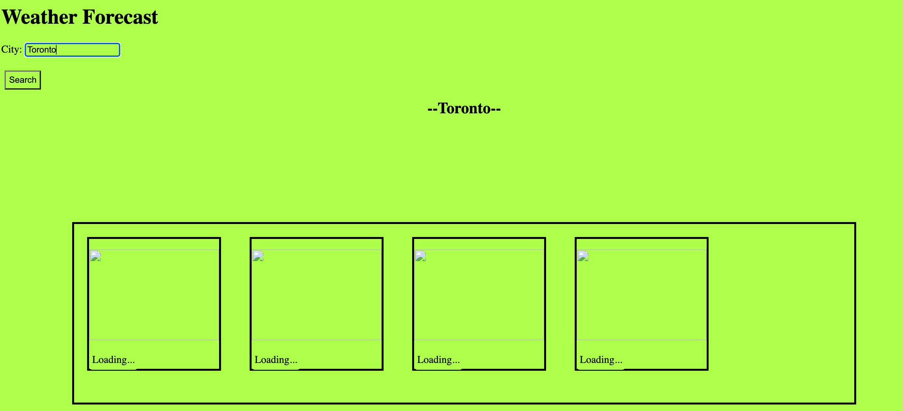

# weather-dashboard

## Made With

## Concept

This is an application for the individual who would like to know the five day forecast for a particular city.

## Description
 The user is able to type any city they wish into the search bar and find out the five day weather forecast for that city. They will be able to learn the temperature, humidity, and wind speed of their chosen city.

## User Story

### AS A traveler
* I WANT to see the weather outlook for multiple cities
* SO THAT I can plan a trip accordingly

## Problems Solved
As someone travelling to a different city they want to know what the weather will be like in that city. This application solves this problem by meeting the following acceptance criteria:

* GIVEN a weather dashboard with form inputs
* WHEN I search for a city
* THEN I am presented with current and future conditions for that city and that city is added to the search history
* WHEN I view current weather conditions for that city
* THEN I am presented with the city name, the date, an icon representation of weather conditions, the temperature, the humidity, and the the wind speed
* WHEN I view future weather conditions for that city
* THEN I am presented with a 5-day forecast that displays the date, an icon representation of weather conditions, the temperature, the wind speed, and the humidity
* WHEN I click on a city in the search history
* THEN I am again presented with current and future conditions for that city

## Usage

The following images show the completed website. You can visit here: 

## Installation

N/A

## License

MIT